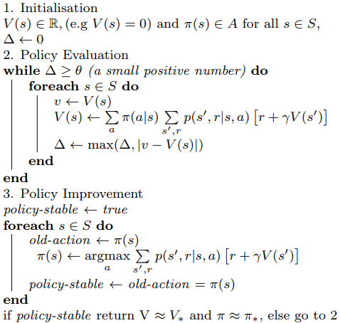
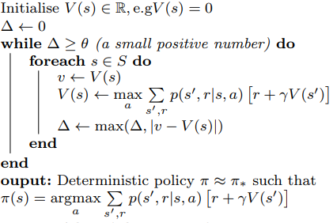
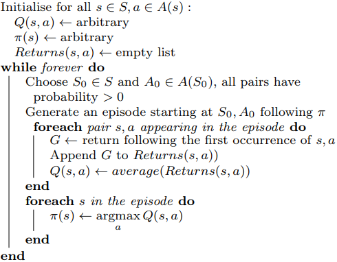
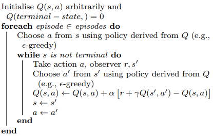
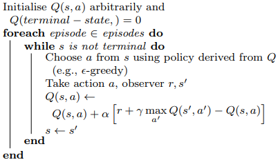
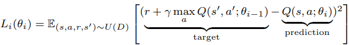
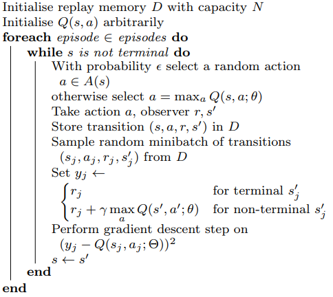

# Reinforcement learning

## Table of Contents

[Table of Contents](#table-of-contents)
  - [1. Overview - Agent-Environment Interface](#1-overview---agent-environment-interface)
  - [2. Defination](#2-defination)
  - [3. Dynamic programming](#3-dynamic-programming)
  - [4. Monte Carlo](#4-monte-carlo)
  - [5. Temporal Difference - Q Learning](#5-temporal-difference---q-learning)
  - [6. Deep Q Learning](#6-deep-q-learning)

## 1. Overview - Agent-Environment Interface
The Agent at each step t receives a representation of the environment's state,  and it selects an action . Then, as a consequence of its action the agent receives a *reward*, $R_{t+1} \in R \in R$
## 2. Defination
  1. Action (A): All the possible moves that the agent can take
  2. State (S): Current situation returned by the environment.
  3. Reward (R): An immediate return send back from the environment to evaluate the last action.
  4. Policy (π): The strategy that the agent employs to determine next action based on the current state.
  5. Value (V): The expected long-term return with discount, as opposed to the short-term reward R. Vπ(s) is defined as the expected long-term return of the current state sunder policy π.
  6. Q-value or action-value (Q): Q-value is similar to Value, except that it takes an extra parameter, the current action a. Qπ(s, a) refers to the long-term return of the current state s, taking action a under policy π.
## 3. Dynamic programming
- ### 3.1 Policy Iteration
    |  |
    |:--:| 
    |* Algorithm 1: Policy Iteration *               |
- ### 3.2 Value Iteration
    |  |
    |:--:| 
    |* Algorithm 2: Value Iteration *               |

## 4. Monte Carlo 
Monte Carlo (MC) is a Model Free method, It does not require
complete knowledge of the environment. It is based on
averaging sample returns for each state-action pair. The
following algorithm gives the basic implementation:
|  |
|:--:| 
|* Algorithm 3: Monte Carlo method first visit * |
### Sarsa
Sarsa (State-action-reward-state-action) is a on-policy TD control. The update rule:

#### n-step Sarsa

#### n-step Sarsa update Q(S, a) towards the n-step Q-return

#### Forward View sarsa()

Forward-view Sarsa()

  |  |
  |:--:| 
  |* Algorithm 4: Sarsa *               |

## 5. Temporal Difference - Q Learning
Temporal Difference (TD) methods learn directly from raw
experience without a model of the environment’s dynamics.
TD substitutes the expected discounted reward Gt from the
episode with an estimation:

The following algorithm gives a generic implementation.

  |  |
  |:--:| 
  |* Algorithm 5: Q learning *               |
## 6. Deep Q Learning
Created by DeepMind, Deep Q Learning, DQL, substitutes
the Q function with a deep neural network called Q-network. It also keep track of some observation in a memory in order to use them to train the network.

Where θ are the weights of the network and U(D) is the
experience replay history.

|  |
|:--:| 
|* Algorithm 5: Deep Q learning *  
